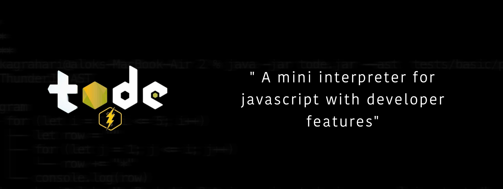
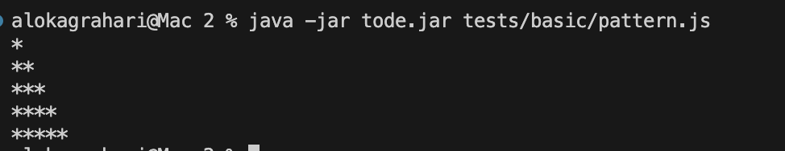
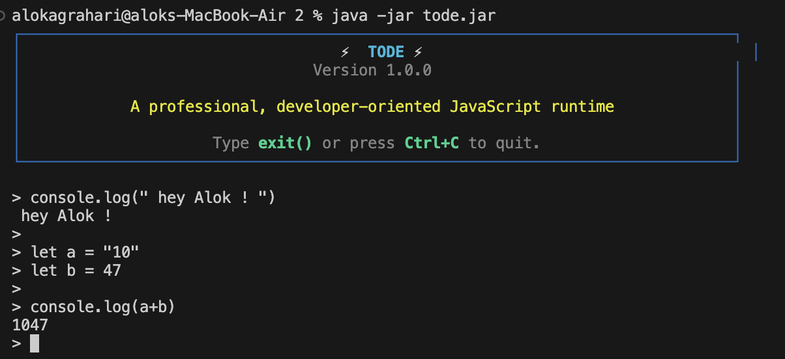
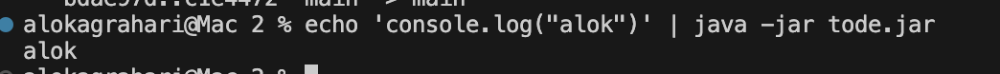
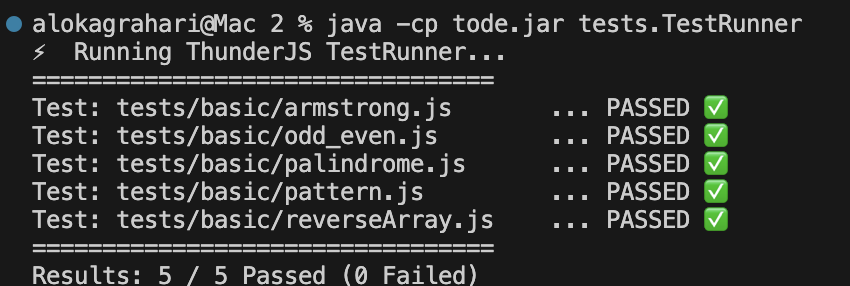
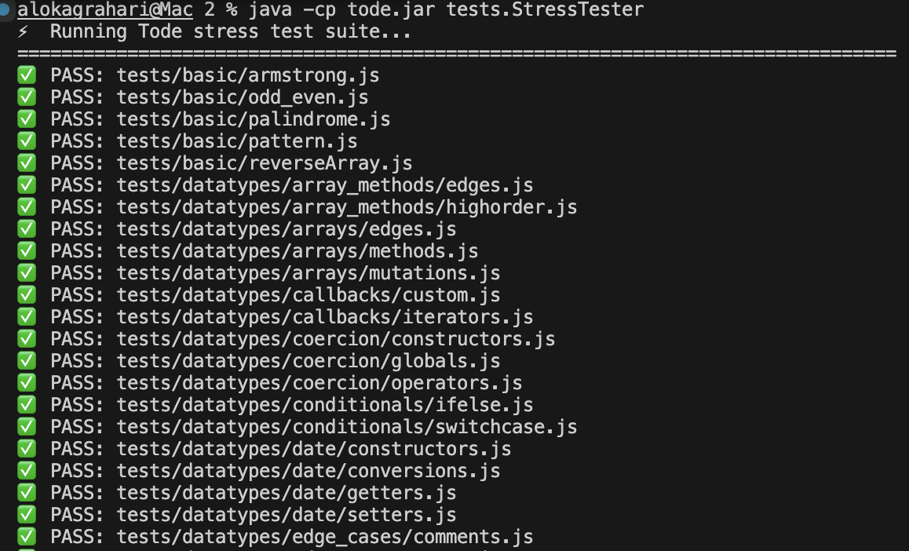
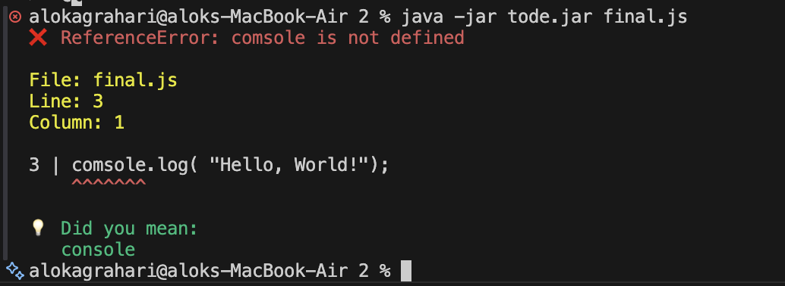
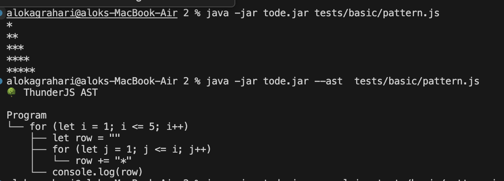

<p align="center">

  

</p>
# ⚡ Tode (Powered by ThunderJS)

### 📖 About
Tode is a high-performance JavaScript runtime built completely from scratch in Java 21, without any external scripting engines (like Nashorn, Rhino, or GraalJS) or parser libraries. It features a handwritten lexer, parser, AST-based interpreter, REPL, and a rich developer experience with advanced source-mapped error diagnostics and suggestion-based recovery.

---

## 🚀 How to Run the Project

### Prerequisites
- **Java 21+** (Verify using `java --version`)

### Run a JavaScript File
```bash
java -jar tode.jar <path-to-file.js>
```
<p align="center">
  
</p>

### Start the Interactive REPL
```bash
java -jar tode.jar
```
<p align="center">
  
</p>
---

### Execute JavaScript via Standard Input (stdin)

```bash
echo 'console.log("alok")' | java -jar tode.jar
```

<p align="center">
  
</p>

## 🧪 Testing Suite (For Judges)

We provide two distinct runners to validate JavaScript compatibility, stress test edge cases, and run benchmarks:

### 1. Basic Test Runner
Runs the 5 standard verification test cases (Armstrong numbers, Odd/Even check, Palindromes, Patterns, and Array reversal):
```bash
java -cp tode.jar tests.TestRunner
```
<p align="center">
  
</p>

### 2. Comprehensive Stress Tester
Recursively scans the test suite, parses assertions, runs individual sandboxed processes, and generates a markdown report:
```bash
java -cp tode.jar tests.StressTester
```

<p align="center">
  
</p>

---

## 🛠️ Developer Tools & Error Diagnostics

Tode offers custom developer flags to introspect execution or debug source files:

```bash
java -jar tode.jar --ast file.js       # Print Abstract Syntax Tree
java -jar tode.jar --trace file.js     # Trace execution step-by-step
java -jar tode.jar --explain file.js   # Human-readable execution explanation
java -jar tode.jar --coverage file.js  # Measure code path coverage
java -jar tode.jar --bench file.js     # Benchmark execution speed
java -jar tode.jar --format file.js    # Format Javascript source code
java -jar tode.jar --minify file.js    # Minify Javascript source code
```

### 🔍 Rich Diagnostics & Typo Suggestions
<p align="center">

  

</p>
If your code has syntax or runtime errors, Tode maps the failure to the source line and column, offering smart typo corrections:

```text
❌ ReferenceError: usernme is not defined

File: login.js
Line: 18
Column: 15

18 | console.log(usernme);
                 ^^^^^^^

💡 Did you mean: username
```

---

## 🏗️ Project Architecture

```text
src/
└── thunderjs/
    ├── lexer/           # Lexical analysis & Tokenization
    ├── parser/          # AST Generation & Operator Precedence parsing
    ├── ast/             # Statement & Expression AST nodes
    ├── interpreter/     # Environment-scoped Tree-Walk Interpreter
    ├── runtime/         # Built-in data types (JSCallable, JSNull, JSUndefined, JSFunction, etc.)
    └── builtins/        # Built-in constructors/objects (Console, Math, Date)
features/                # Developer tools (Explain, Formatter, Minifier, ASTPrinter, etc.)
tests/                   # Organized test suites
├── basic/               # 5 standard verification test cases
└── datatypes/           # 18 subfolders spanning 55+ feature/datatype stress tests
```
---

## ⚙️ Runtime Pipeline

```text
  JS Source File ──> [ Lexer ] ──> [ Parser ] ──> [ AST Structure ]
                                                          │
   Output / REPL <── [ PrintStream ] <── [ Interpreter ] ◄┘
```
<p align="center">

  

</p>
---

## 🌟 Supported Language Features

- **Variables & Scoping**: `let`, `const`, `var` (lexical block-scoping)
- **Primitives**: Numbers, Strings, Booleans, `null`, `undefined`
- **Operators**: Full arithmetic, comparison, logical operations, updates (`++`/`--`), and compound assignments (`+=`, `-=`, etc.)
- **Control Flow**: `if/else`, `switch/case`
- **Loops**: `for`, `while`, `do-while`
- **Collections & Data Structures**:
  - **Arrays**: Native methods (`push`, `pop`, `join`, `reverse`, `length`)
  - **Objects**: Native property lookups, bracket notations, nested modifications
- **Functions**: Closures, arrow functions, parameter scope, recursion
- **Callbacks**: General callback parameters for builtins (`map`, `filter`, `reduce`, `find`, `some`, `every`)
- **Builtin Modules**:
  - `Math`: `Math.floor`, `Math.ceil`, `Math.random`, `Math.abs`, `Math.max`, `Math.min`, `Math.pow`, `Math.sqrt`
  - `Date`: Fully functional `Date` constructor, getters/setters, timestamps, ISO string conversion
- **ES6 Features**: Spread & Rest operators (`...`) for objects, arrays, and parameters